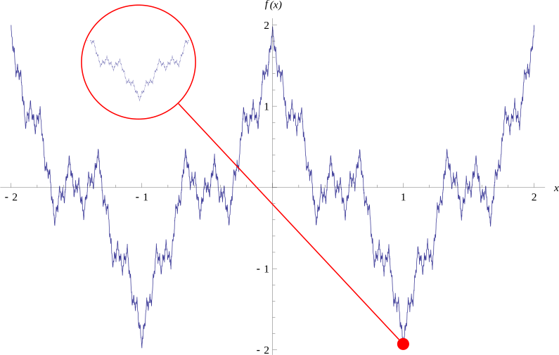

---
微积分与线性代数复习（作者：谷良）
---
## 微积分
 ***
- 极限理论是微积分学的基础，极限的概念与思想方法始终贯穿于微积分之
中，是研究函数变化特征的一个重要工具。对于自变量的变化过程中相应函数值
变化趋势的讨论，引出了函数极限的概念。由于自变量变化过程不同，函数的极
限表现为不同的形式，而数列极限就是定义在正整数集上的函数当自变量趋于无
穷大时的极限。
### 函数的极限
 ***
- 定义： 设函数 $f(x)$ 在 点 $x_0$ 的某一去心邻域内有定义，如果存在常数 A 对于任意给定的正数 $\epsilon$（无论它多么小），总存在正数 $\delta$，使得当x满足不等式 $0<\mid x-x_0 \mid <\delta$,对应的函数值 $f(x)$ 都满足不等式：$\mid f(x)-A \mid < \epsilon$, 那么常数A就叫做函数 $f(x)$ 当 $x\rightarrow x_0$ 时的极限，记作 $$\lim_{x\rightarrow x_0}f(x) = A$$ 或 $f(x)\rightarrow A$ (当$x\rightarrow x_0$)。
### 数列极限
 ***
#### 数列定义
- 若函数 $f$ 的定义域为全体正整数集合 $N^+$ ，则称 $$ f:N^+\rightarrow R \ \ \  f(n), n\in N^+ $$ 为数列。因正整数集 $N^+$ 的元素可按由小到大的顺序排列，故数列$f(n)$也可写作 $a_1,a_2, ... a_n, ...$或者简单记为 $\{a_n\}$
#### 数列极限
- 定义 设为数列 $\{a_n\}$，$a$为定数。若对任给的正数$\epsilon$，总存在正整数$N$，使得当$n > N$时有
$$ \mid a_n - a \mid < \epsilon $$
则称数列$\{a_n\}$收敛于$a$，定数$a$称为数列$\{a_n\}$的极限，并记作
$$ \lim_{n\rightarrow \infty}a_n = a $$

### 导数
***
> 当函数$y=f(x)$的自变量$x$在一点$x_0$上产生一个增量$\Delta x$时，函数输出值的增量$\Delta y$与自变量增量$\Delta x$的比值在$\Delta x$趋于0时的极限$a$如果存在，$a$即为在$x0$处的导数，记作$f'(x_0)$或$\frac{df(x_0)}{dx}$。
- 导数是函数的局部性质。一个函数在某一点的导数描述了这个函数在这一点附近的变化率。如果函数的自变量和取值都是实数的话，函数在某一点的导数就是该函数所代表的曲线在这一点上的切线斜率。导数的本质是通过极限的概念对函数进行局部的线性逼近。例如在运动学中，物体的位移对于时间的导数就是物体的瞬时速度。
- 不是所有的函数都有导数，一个函数也不一定在所有的点上都有导数。若某函数在某一点导数存在，则称其在这一点可导，否则称为不可导。然而，可导的函数一定连续；不连续的函数一定不可导。例如 魏尔斯特拉斯函数:
  $$ f(x) = \sum^{\infty}_{n=0}a^n \cos(b^n\pi x) $$
  其中$0 < a < 1$, $b$是正奇数，使得$ab > 1 + \frac32\pi$

#### 偏导数
- 在数学中，一个多变量的函数的偏导数，就是它关于其中一个变量的导数而保持其他变量恒定（相对于全导数，在其中所有变量都允许变化）
- 在一元函数中，导数就是函数的变化率。对于二元函数研究它的“变化率”，由于自变量多了一个，情况就要复杂的多。
例如 在 $xOy$ 平面内，当动点由 $P(x0,y0)$ 沿不同方向变化 时，函数 $f(x,y)$ 的变化快慢一般说来是不同的，因此就需要研   究 $f(x,y)$ 在 $(x0,y0)$ 点处沿不同方向的变化率。
- 偏导数的表示符号为: $\partial$, 其反映的是函数沿坐标轴正方向的变化率。
##### 求法
- 当函数 $z=f(x,y)$ 在 $(x0,y0)$的两个偏导数 $f'x(x0,y0)$ 与 $f'y(x0,y0)$都存在时，我们称 $f(x,y)$ 在 $(x0,y0)$处可导。如果函数 $f(x,y)$ 在域 $D$ 的每一点均可导，那么称函数 $f(x,y)$ 在域 $D$ 可导。

- 此时，对应于域 $D$ 的每一点 $(x,y)$ ，必有一个对 $x$ (对 $y$ )的偏导数，因而在域 $D$ 确定了一个新的二元函数，称为 $f(x,y)$ 对 $x$ (对 $y$ )的偏导函数。简称偏导数。

- 按偏导数的定义，将多元函数关于一个自变量求偏导数时，就将其余的自变量看成常数，此时他的求导方法与一元函数导数的求法是一样的。
##### 几何意义
- 表示固定面上一点的切线斜率。
偏导数 $f'x(x0,y0)$ 表示固定面上一点对 $x$ 轴的切线斜率；偏导数 $f'y(x0,y0)$ 表示固定面上一点对 $y$ 轴的切线斜率。
高阶偏导数：如果二元函数$ z=f(x,y)$ 的偏导数 $f'x(x,y)$ 与 $f'y(x,y)$ 仍然可导，那么这两个偏导函数的偏导数称为 $z=f(x,y)$ 的二阶偏导数。二元函数的二阶偏导数有四个：$f''xx$，$f''xy$，$f''yx$，$f''yy$。
### 梯度
- 梯度的本意是一个向量（矢量），表示某一函数在该点处的方向导数沿着该方向取得最大值，即函数在该点处沿着该方向（此梯度的方向）变化最快，变化率最大（为该梯度的模）

- 梯度指一个向量，梯度与方向向量的数量积就是方向导数。方向导数刻画了在某一方向上函数的变化率，梯度的本质含义就是变化率最快的方向。如果梯度按照梯度方向求方向导数的话，其值一定是最大的。也就是说，在某一点的各个方向上，只有沿着梯度方向，变化最剧烈。梯度的模就是最大的方向导数。

- 在单变量的实值函数的情况，梯度只是导数，或者，对于一个线性函数，也就是线的斜率。
- 梯度一词有时用于斜度，也就是一个曲面沿着给定方向的倾斜程度。可以通过取向量梯度和所研究的方向的点积来得到斜度。梯度的数值有时也被称为梯度。

> 定义
 设二元函数$ z=f(x,y) $在平面区域$D$上具有一阶连续偏导数，则对于每一个点$P(x,y)$都可定出一个向量 $\{\frac{\partial f}{\partial x},\frac{\partial f}{\partial y} \} = f_x(x,y)\vec i + f_y(x,y) \vec j$,该函数就称为n函数$ z=f(x,y) $,在$ P(x,y) $的d梯度，计作$gradf(x,y)$ 或 $ \nabla f(x,y) $, 即为：
  $$ gradf(x,y) = \nabla f(x,y) = \{\frac{\partial f}{\partial x},\frac{\partial f}{\partial y} \} = f_x(x,y)\vec i + f_y(x,y) \vec j $$

  其中 $ \nabla = \frac{\partial}{\partial x}\vec i +  \frac{\partial}{\partial y}\vec j$称为（二维的）向量微分算子或$ Nabla $算子。
  $\because \nabla = \frac{\partial f}{\partial x}\vec i +  \frac{\partial f}{\partial y}\vec j $ 
  设 $ e = \{\cos\alpha, \sin \beta \} $是方向$ l $上的单位向量，则:
  $$  \frac{\partial f}{\partial l} = \frac{\partial f}{\partial x} \cos\alpha + \frac{\partial f}{\partial y} \cos\beta = \{\frac{\partial f}{\partial x},\frac{\partial f}{\partial y} \} \{\cos\alpha, \sin \beta \} = grad f(x, y)e =\mid grad f(x, y)\mid  |e|\cos [grad f(x, y), e] $$
  由于当方向$l$与梯度方向一致时，有
    $$ \cos [grad f(x, y), e] = 1 $$
  
  $ \therefore $ 所以当$l$与梯度方向一致时,方向导数$ \frac{\partial f}{\partial l} $有最大值，且最大值为梯度的模，即
    $$ \mid grad f(x, y) \mid = \sqrt[2]{(\frac{\partial f}{\partial x})^2 + (\frac{\partial f}{\partial y})^2 } $$

  因此说，函数在一点沿梯度方向的变化率最大，最大值为该梯度的模

### 积分
> 通常分为定积分和不定积分两种
- 定积分是积分的一种，是函数$f(x)$在区间$[a,b]$上的积分和的极限。
- 不定积分 在微积分中，一个函数$ f $的不定积分，或原函数，或反导数，是一个导数等于$f$ 的函数 $F$ ，即$F' = f$。

- 牛顿-莱布尼兹公式（Newton-Leibniz formula），通常也被称为微积分基本定理，揭示了定积分与被积函数的原函数或者不定积分之间的联系

> 一个连续函数在区间 $[ a, b ]$ 上的定积分等于它的任意一个原函数在区间$[a,b] $上的增量

- 如果函数$f(x)$在区间$[a, b]$上连续，并且存在原函数$F(x)$,则：
 $$ \int_a^b f(x)dx = F(b) - F(a) = F(x)\mid_a^b $$

 #### 意义
  - 使人们找到了解决曲线的长度，曲线围成的面积和曲面围成的体积这些问题的一般方法。它简化了定积分的计算，只要知道被积函数的原函数，总可以求出定积分的精确值或一定精度的近似值
  - 是联系微分学与积分学的桥梁，它是微积分中最基本的公式之一。它证明了微分与积分是可逆运算，同时在理论上标志着微积分完整体系的形成
  - 还可以推广到二重积分与曲线积分，从一维推广到多维

## 线性代数
***
> 线性代数是数学的一个分支，它的研究对象是向量，向量空间（或称线性空间），线性变换和有限维的线性方程组。向量空间是现代数学的一个重要课题；因而，线性代数被广泛地应用于抽象代数和泛函分析中；通过解析几何，线性代数得以被具体表示。线性代数的理论已被泛化为算子理论。由于科学研究中的非线性模型通常可以被近似为线性模型，使得线性代数被广泛地应用于自然科学和社会科学

- 如果进入科研领域，你就会发现，只要不是线性的东西，我们基本都不会！线性是人类少数可以研究得非常透彻的数学基础性框架。
- 所谓“线性”，指的就是如下的数学关系: $ f(x+y) = f(x) + f(y) $。其中，$f$叫线性算子或线性映射; 所谓“代数”，指的就是用符号代替元素和运算
 也就是说：我们不关心上面的$x, y$是实数还是函数，也不关心$f$是多项式还是微分，我们统一把他们都抽象成一个记号，或是一类矩阵。合在一起，线性代数研究的就是：满足线性关系 $ f(x+y) = f(x) + f(y)$ 的线性算子$f$都有哪几类，以及他们分别都有什么性质.

 ### 矩阵

 例如：
 $ 4x -5y = -13 $
 $ -2x + 3y = 9 $
 用矩阵表示： $ Ax = b $
 其中：$ 
 A = \left[\begin{matrix}
  4 & -5 \\
  -2 & 3 \\
  \end{matrix}\right] 
$ $
b = \left[\begin{matrix}
  -13 \\
  9 \\
  \end{matrix}\right] 
$

- 符号$A \in R^{m×n}$表示一个m行n列的矩阵，并且矩阵A中的所有元素都是实数。
- 我们用$a_{ij}$ (或$A_{ij}$，等) 表示第$i$行第$j$列的元素;

- 矩阵 $A \in R^{m×n}$和$B \in R^{n×p}$ 的乘积为矩阵
  $ C=AB = AB \in R^{m×p} $
> 请注意，矩阵A的列数应该与矩阵B的行数相等，这样才存在矩阵的乘积

#### 矩阵内积和外积
- 一个行向量乘以一个列向量称作向量的内积，又叫作点积，结果是一个数；
> 给定两个向量$x,y \in R^n$，那么$x^T y$的值，我们称之为向量的内积或点积。它是一个由下式得到的实数：
$$ 
  x^T y \in R = \left[\begin{matrix}
  x_1, x_2, \ldots, x_n 
  \end{matrix}\right]  \left[\begin{matrix}
  y_1 \\
  y_2 \\ 
  \ldots \\
   y_n 
  \end{matrix}\right] = \sum^n_{i=1} x_iy_i
$$

内积实际上是矩阵乘法的一个特例。通常情况下$x^T y = y^T x$。
> 几何定义 设二维空间内有两个向量$\vec a$和  $\vec b$,$|\vec a|$ 和 $|\vec b|$ 表示向量a和b的大小，它们的夹角为 $ \theta(0 \leq \theta \leq \pi)  $ ，则内积定义为以下实数:
  $$ \vec a \cdot \vec b = |\vec a||\vec b|\cos\theta $$

- 一个列向量乘以一个行向量称作向量的外积，外积是一种特殊的克罗内克积(两个任意大小的矩阵间的运算，表示为 $\otimes$)，结果是一个矩阵，
> 对于向量$x \in R^m, y \in R^n$（大小不必相同），$xy^T ∈ R^{m×n}$称为向量的外积
$$
  \begin{bmatrix}b_1 \\ b_2 \\ b_3 \\ b_4\end{bmatrix}  \otimes   \begin{bmatrix}a_1 & a_2 & a_3\end{bmatrix} = \begin{bmatrix}a_1b_1 & a_2b_1 & a_3b_1 \\ a_1b_2 & a_2b_2 & a_3b_2 \\ a_1b_3 & a_2b_3 & a_3b_3 \\ a_1b_4 & a_2b_4 & a_3b_4\end{bmatrix}
$$

#### 转置和逆矩阵
- 转置是一个数学名词。直观来看，将A的所有元素绕着一条从第1行第1列元素出发的右下方45度的射线作镜面反转，即得到A的转置。一个矩阵M, 把它的第一行变成第一列，第二行变成第二列，......,最末一行变为最末一列， 从而得到一个新的矩阵N。 这一过程称为矩阵的转置。即矩阵A的行和列对应互换 ，记为 $A^T$

- 设$A$是数域上的一个$n$阶方阵，若在相同数域上存在另一个$n$阶矩阵B，使得： $AB=BA=E$。 则我们称$B$是$A$的逆矩阵，而$A$则被称为可逆矩阵, 记作$ A^{-1} $

如果矩阵A可逆，则 $ A^{-1} = \frac{A^*}{|A|} $,其中$A^*$是$A$的伴随矩阵。
> $A^*$中元素的排列特点是 $A^* $的第 $ k $列元素是 $A$的第  $k$行元素的代数余子式.

> 在n阶行列式D中划去任意选定的k行、k列后，余下的元素按原来顺序组成的n-k阶行列式M，称为行列式D的k阶子式A的余子式。如果k阶子式A在行列式D中的行和列的标号分别为$i_1,i_2, \ldots, i_k$和$j_1,j_2, \ldots, j_k$则在A的余子式M前面添加符号。
$$
  -1^{(i_1,i_2, \ldots, i_k) + (j_1,j_2, \ldots, j_k)}
$$
后,所得到的n-k阶行列式，称为行列式D的k阶子式A的代数余子式

#### 秩

> 在线性代数中，一个矩阵A的列秩是A的线性独立的纵列的极大数, 类似地，行秩是A的线性独立的横行的极大数目. 
- 方阵的列秩和行秩总是相等的，因此它们可以简单地称作矩阵 A 的秩, 通常表示为r(A)，rk(A)或rank A.
m × n矩阵的秩最大为m和n中的较小者，表示为 $min(m,n)$。有尽可能大的秩的矩阵被称为有满秩；类似的，否则矩阵是秩不足（或称为“欠秩”）的。

#### 特征值
> 设A是n阶方阵，如果数λ和n维非零列向量x使关系式Ax=λx成立，那么这样的数λ称为矩阵A特征值，非零向量x称为A的对应于特征值λ的特征向量。式Ax=λx也可写成(A-λE)X=0。这是n个未知数n个方程的齐次线性方程组，它有非零解的充分必要条件是系数行列式| A-λE|=0。
- 特征空间就是由所有有着相同特征值的特征向量组成的空间
矩阵看作是运动，对于运动而言，最重要的当然就是运动的速度和方向
- 特征值就是运动的速度
- 特征向量就是运动的方向
例子：
 $$
  A = \left[\begin{matrix}
  0 & 1 & 0 \\
  0 & 0 & 1 \\
  -1 & -3 & -3 \\
  \end{matrix}\right] 
 $$

 $ (\lambda+1)^3=0$
 $ \lambda = -1 $

#### 奇异值
> 一般通过奇异值分解定理求得。设A为$m*n$阶矩阵，$q=min(m,n)$，$A^*A$的q个非负特征值的算术平方根叫作A的奇异值。
奇异值分解是线性代数和矩阵论中一种重要的矩阵分解法，适用于信号处理和统计学等领域

